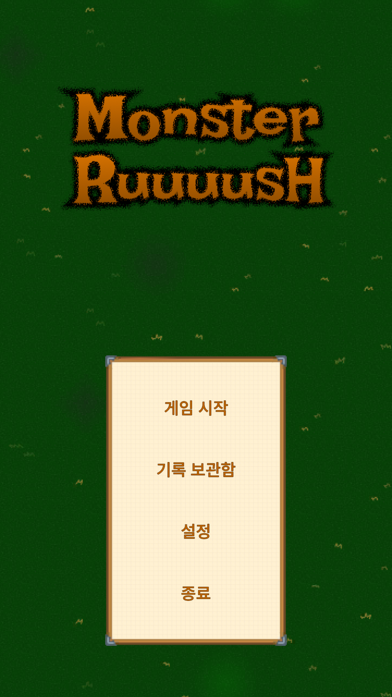
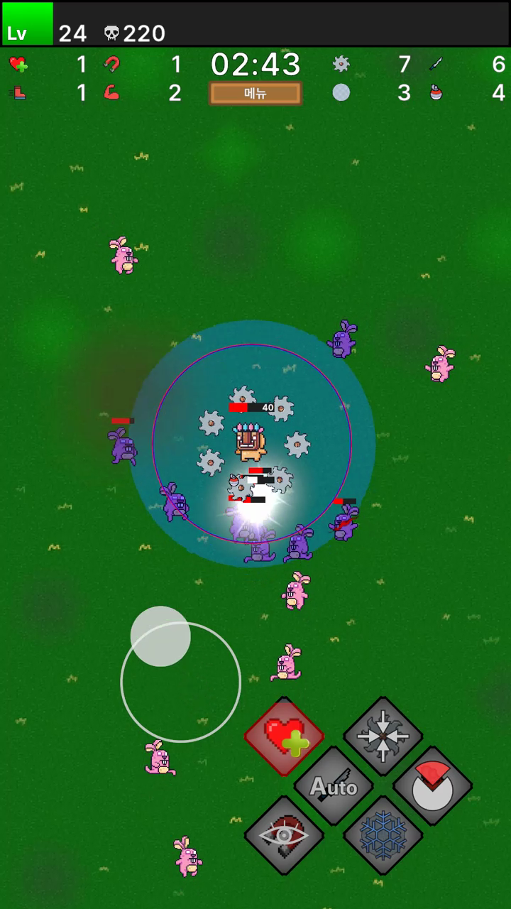
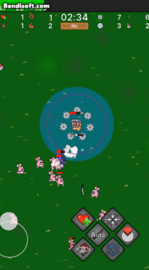
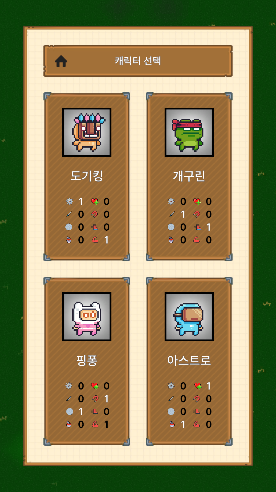
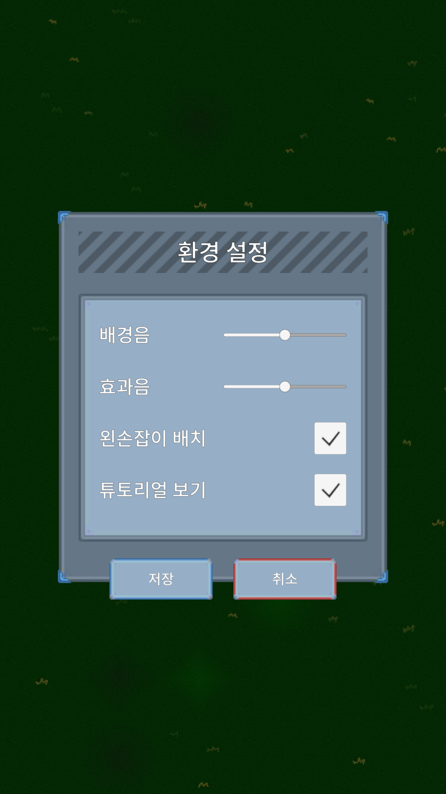
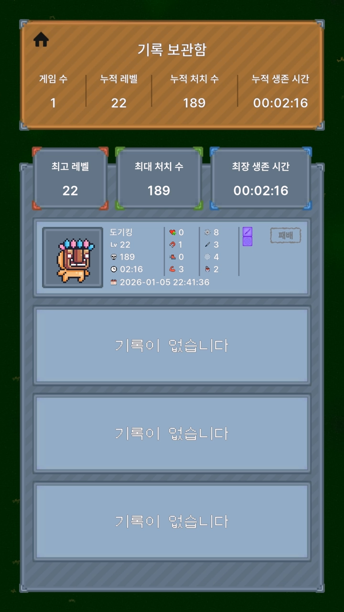
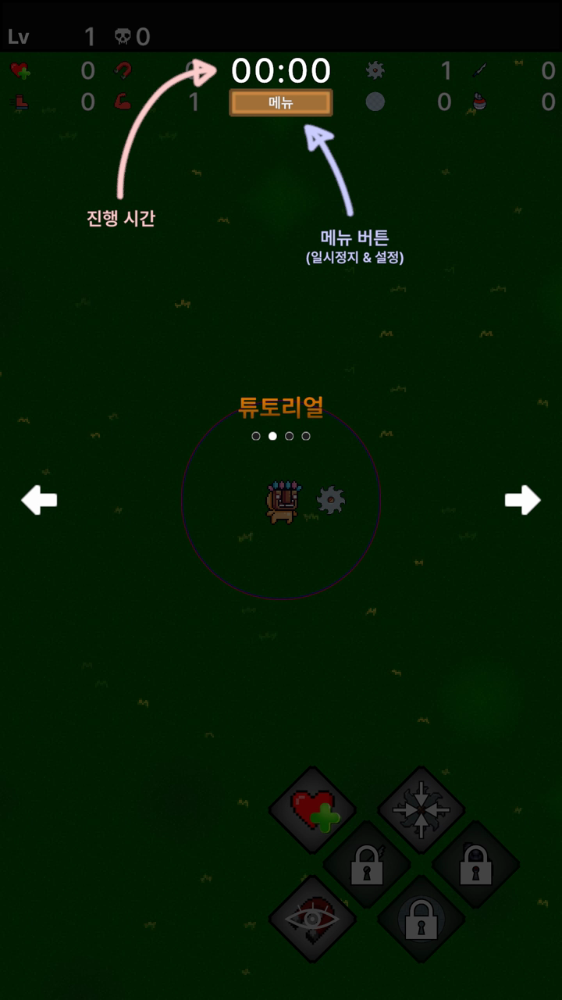
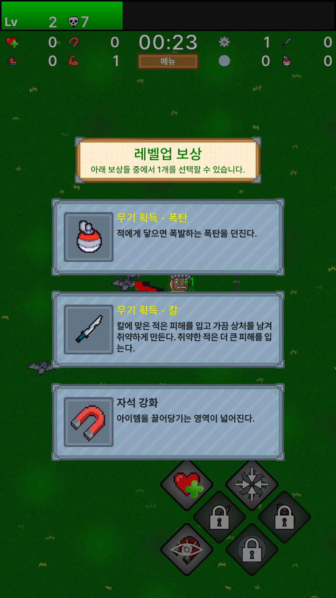
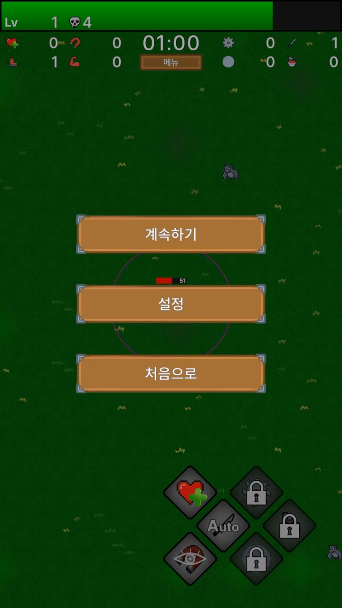
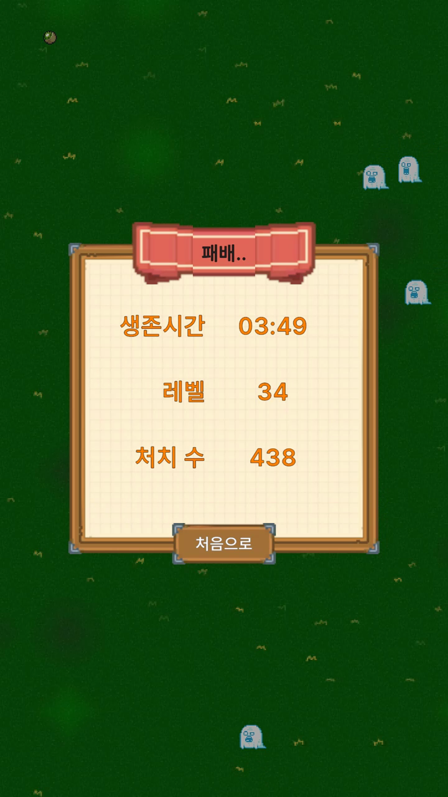

# 개요
MonsterRush는 Unity로 제작한 Android 액션 게임이며,</br>
뱀파이어 서바이벌 장르를 모티브로 합니다.

이 프로젝트는 **성능 최적화와 구조적 확장성**에 중점을 두고 설계되었습니다.</br>

<table>
  <tr>
    <td align="center">
      </br>
      <b>메인 메뉴</b></br>
    </td>
    <td align="center">
      </br>
      <b>인게임</b></br>
    </td>
    <td align="center">
      </br>
      <b>인게임 플레이</b></br>
    </td>
  </tr>
</table>

</br>
[구글 플레이 스토어 링크](https://play.google.com/store/apps/details?id=com.DefaultCompany.VampireSurvivalLike)


# 목표 
### 최적화
```
1. 오브젝트 풀링
  - 오디오, 맵, 몬스터 등 같은 오브젝트를 계속 쓰는 경우

2. 힙 메모리 할당 최소화
  - 힙은 비용이 불확실한 GC 발생

3. 유니티의 기능을 덜어내야함
  - Update 최소화 -> 수백 개의 개체에서 Update()를 돌지 않고 관리자 클래스를 만들어 한번의 Update()에서 반복문으로 처리
  - 콜라이더 최소화 -> 켜져 있는 것만으로도 연산비용이 크다
  - 애니메이터 제거 -> 스크립트로 제어
```
### 스토어 출시 경험
```
[경험 O] 실제 사용 피드백 반영
[경험 O] 스토어 심사 기준 이해
[경험 O] 개인정보처리방침, 이용약관 대응
[경험 X] 광고·결제·로그인 정책 이해
[경험 X] 리젝 대응 경험
[경험 O] 버전 관리 & 재심사 프로세스 이해
```

# 회고
### 개선점
```
1. 상세 기획 및 유사 게임 분석 미흡
  - 사용성 및 게임 밸런스 및 지루함 개선 필요

2. 플레이 스토어 기능 활용 미흡
  - 리더보드를 활용했더라면 로컬 파일로 기록을 남기는 것보다 더 좋고 많은 것을 할 수 있었음

3. 완성도 부족한 리소스
  - 퀄리티도 미흡하고 일관되지 않아 덕지덕지 붙인 느낌이 강함
```

# 구조
<details>
<summary><strong>Scene & UI</strong></summary>
</br>
<b>Scene</b> </br>
├─ Init - 데이터 로드 및 초기화 </br>
├─ Title - 메인 메뉴 씬</br>
└─ Game - 인게임 플레이 씬</br>
</br>
  
<b>Window</b>- Scene 내부 UI 상태 단위</br>
├─ <b>Title</b></br>
│&nbsp;&nbsp;&nbsp;&nbsp;├─ Home - 기본 화면</br>
│&nbsp;&nbsp;&nbsp;&nbsp;├─ Character - 캐릭터 선택 화면</br>
│&nbsp;&nbsp;&nbsp;&nbsp;├─ Setting - 환경설정 화면 </br>
│&nbsp;&nbsp;&nbsp;&nbsp;└─ History - 플레이 기록 화면</br>
│</br>
└─  <b>Game</b></br>
&nbsp;&nbsp;&nbsp;&nbsp;&nbsp;&nbsp;├─ Normal - 인게임 및 튜토리얼 화면</br>
&nbsp;&nbsp;&nbsp;&nbsp;&nbsp;&nbsp;├─ Reward - 보상 선택 화면</br>
&nbsp;&nbsp;&nbsp;&nbsp;&nbsp;&nbsp;├─ Pause - 메뉴 & 일시정지 화면</br>
&nbsp;&nbsp;&nbsp;&nbsp;&nbsp;&nbsp;├─ Ending - 엔딩 화면</br>
&nbsp;&nbsp;&nbsp;&nbsp;&nbsp;&nbsp;└─ Setting - 환경설정 화면</br>

<table>
  <tr>
    <th colspan="5"> Title </th>  
  </tr>
  <tr>
    <td align="center">
      </br>
      <b>Home</b></br>
    </td>
    <td align="center">
      </br>
      <b>Character</b></br>
    </td>
    <td align="center">
      </br>
      <b>Setting</b></br>
    </td>
    <td align="center">
      </br>
      <b>History</b></br>
    </td>
    <td align="center">
      empty
    </td>
  </tr>
  <tr>
    <th colspan="5"> Game </th>  
  </tr>
  <tr>
    <td align="center">
      </br>
      <b>Normal.Tutorial</b></br>
    </td>
    <td align="center">
      </br>
      <b>Normal.Ingame</b></br>
    </td>
    <td align="center">
      </br>
      <b>Reward</b></br>
    </td>
    <td align="center">
      </br>
      <b>Pause</b></br>
    </td>
    <td align="center">
      </br>
      <b>Ending</b></br>
    </td>
  </tr>
</table>
</details>
</br>
<details>
<summary><strong>Object Pooling System</strong> - 대량 오브젝트 처리</summary>
</br>
├─ <b>Map Container</b> - 무한 맵 타일 </br>
│&nbsp;&nbsp;&nbsp;&nbsp;└─ Map Tile</br>
│</br>
├─ <b>Item Container</b> - 아이템 오브젝트 풀링</br>
│&nbsp;&nbsp;&nbsp;&nbsp;├─ Item</br>
│&nbsp;&nbsp;&nbsp;&nbsp;└─ Item Box</br>
│</br>
├─ <b>Enemy Container Group</b> - 등급별 Enemy Container 관리</br>
│&nbsp;&nbsp;&nbsp;&nbsp;└─ <b>Enemy Container</b> - 적 오브젝트 풀링 </br>
│&nbsp;&nbsp;&nbsp;&nbsp;&nbsp;&nbsp;&nbsp;&nbsp;&nbsp;&nbsp;└─ Enemy</br>
│</br>
└─ <b>UI Container</b> - UI 오브젝트 풀링</br>
&nbsp;&nbsp;&nbsp;&nbsp;&nbsp;&nbsp;└─ Combat Text</br>
</details>
</br>
<details>
<summary><strong>Data Management</strong></summary>
</br>
├─ <b>Scriptable Object</b> - 대량 오브젝트 참조 </br>
│&nbsp;&nbsp;&nbsp;&nbsp;├─ Reward</br>
│&nbsp;&nbsp;&nbsp;&nbsp;├─ Enemy</br>
│&nbsp;&nbsp;&nbsp;&nbsp;└─ Item</br>
│</br>
├─ <b>Inspector</b> - 단일 오브젝트 설정 </br>
│&nbsp;&nbsp;&nbsp;&nbsp;└─ Enemy Container</br>
│</br>
└─ <b>JSON File</b> - 외부 파일 저장 </br>
&nbsp;&nbsp;&nbsp;&nbsp;&nbsp;&nbsp;└─ Game History </br>
</details>


# 리소스
</br>
💻 <b>UI</b>
</br>
├─ https://www.kenney.nl/assets/ui-pack-pixel-adventure</br>
├─ https://www.kenney.nl/assets/game-icons</br>
└─ https://assetstore.unity.com/packages/tools/input-management/joystick-pack-107631</br>
</br>

🖼 <b>Texture</b>
</br>
├─ https://assetstore.unity.com/packages/2d/environments/pixel-art-platformer-village-props-166114</br>
├─ https://assetstore.unity.com/packages/2d/characters/pixel-adventure-1-155360</br>
├─ https://assetstore.unity.com/packages/2d/characters/pixel-adventure-2-155418</br>
├─ https://assetstore.unity.com/packages/2d/characters/pixel-art-character-package-312497</br>
└─ Figma 자체제작 및 AI 생성</br>
</br>

✨ <b>VFX</b>
</br>
└─ https://assetstore.unity.com/packages/vfx/particles/casual-rpg-vfx-239285</br>
</br>

🎵 <b>SFX</b>
</br>
├─ https://freesound.org/</br>
└─ https://assetstore.unity.com/packages/audio/sound-fx/universal-sound-fx-17256</br>
</br>

🎞 <b>DoTween</b>
</br>
└─ https://assetstore.unity.com/packages/tools/animation/dotween-hotween-v2-27676</br>
